<h1 align="center">
  
  Stargazer - Daily Cosmos Explorer
</h1>

<div align="center">

[](https://www.android.com/)
[](https://kotlinlang.org/)
[](https://developer.android.com/jetpack/compose)
[](https://firebase.google.com/)
[](https://api.nasa.gov/)


### 🌟 Explore the Universe Daily | 🎯 Build Your Streak | 🏆 Unlock Achievements

*A beautifully crafted Android application that brings NASA's Astronomy Picture of the Day to your device, featuring gamified streak tracking and an achievement system inspired by space exploration.*

**[📥 Download APK](#-installation) • [🚀 Features](#-core-features) • [📸 Screenshots](#-screenshots) • [🏗 Architecture](#-architecture--tech-stack) • [🤝 Contributing](#-contributing)**

---

</div>

## ✨ What is Stargazer?

**Stargazer** is not just another space app—it's your personal mission control for daily cosmic exploration. Built with modern Android development best practices, it combines:

🌌 **Daily Cosmic Discovery** - Experience NASA's breathtaking Astronomy Picture of the Day  
🔥 **Streak Gamification** - Build consistency with intelligent streak tracking  
🎖️ **Military-Grade Progression** - Earn ranks from Observer to Voyager  
🎨 **Space-Themed UI/UX** - Immersive design inspired by sci-fi terminals  
☁️ **Cloud Sync** - Your progress saved securely via Firebase  

> *"Every day brings a new window into the infinite cosmos. Will you maintain your streak, Commander?"*

---

## 🎯 Core Features

<table>
<tr>
<td width="50%">

### 🔐 **Authentication System**

- 🔑 Secure Firebase Authentication
- 📧 Email/Password registration
- 👤 Custom username ("Callsign") support
- 🔄 Auto-login with session persistence
- 🚪 Seamless onboarding experience

</td>
<td width="50%">

### 🌠 **Daily Cosmos Feed**

- 🖼️ HD Astronomy images via NASA APOD API
- 🔍 Full-screen image viewer
- 📝 Detailed mission logs (descriptions)
- 🔗 Direct NASA source linking
- ©️ Proper copyright attribution

</td>
</tr>
<tr>
<td width="50%">

### 📈 **Streak Tracking**

- 📅 Intelligent daily login detection
- 🔥 Automatic streak increment/reset
- 📊 Historical max streak tracking
- ☁️ Cloud-synced via Firestore
- ⚡ Real-time data updates

</td>
<td width="50%">

### 🏅 **Achievement System**

- 🎖️ 8 unique rank badges
- 🔒 Progressive unlock system
- 📜 Detailed badge descriptions
- 🎨 Grayscale locked states
- 🎭 Interactive badge dialogs

</td>
</tr>
</table>

---

## 📸 Screenshots

<div align="center">

### Authentication Flow
| Login Terminal | Recruitment (Sign Up) |
|:---:|:---:|
| 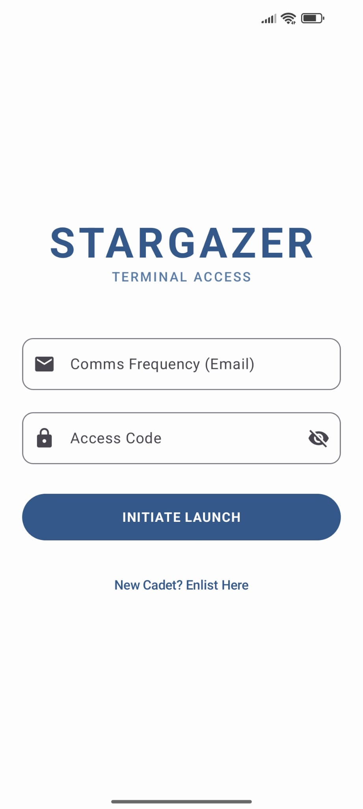 | 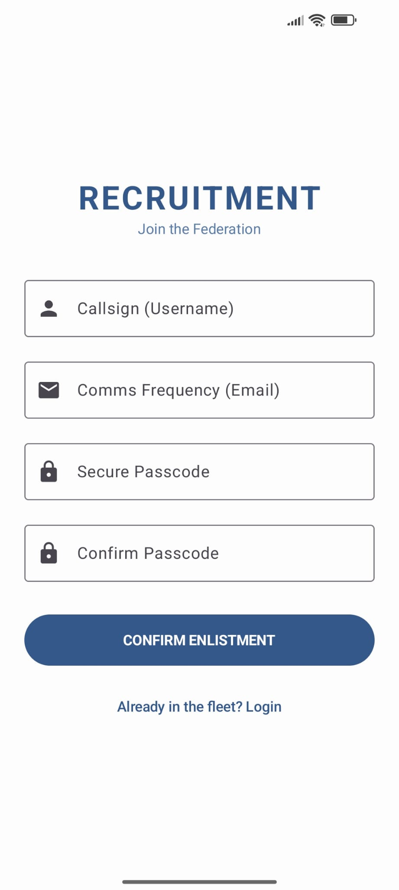 |
| *Secure Terminal Access* | *Join the Federation* |

### Main Experience 
| Daily Cosmos (Home) | Commander Profil | Achievement Unlocked | Badge Details |
|:---:|:---:|:---:|:---:|
| 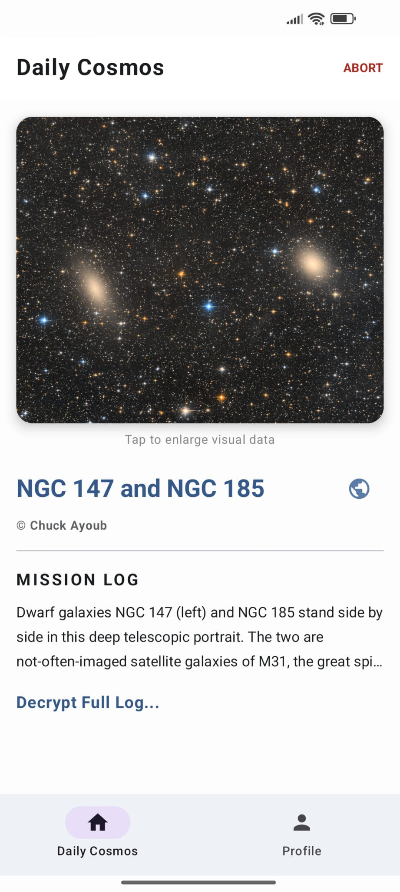 | 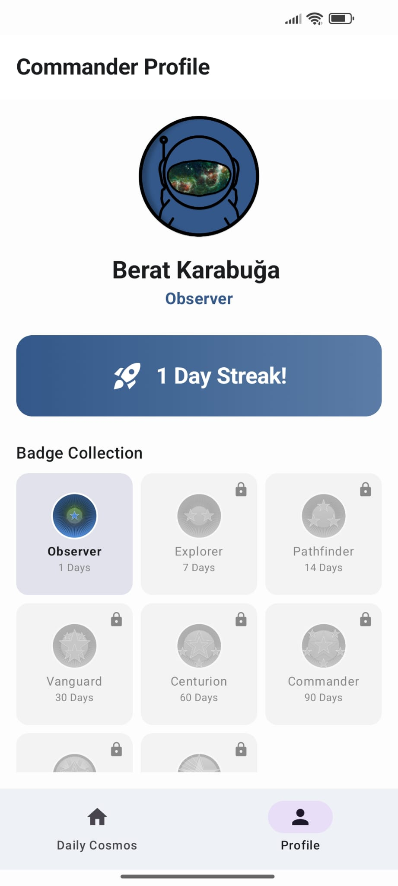 | 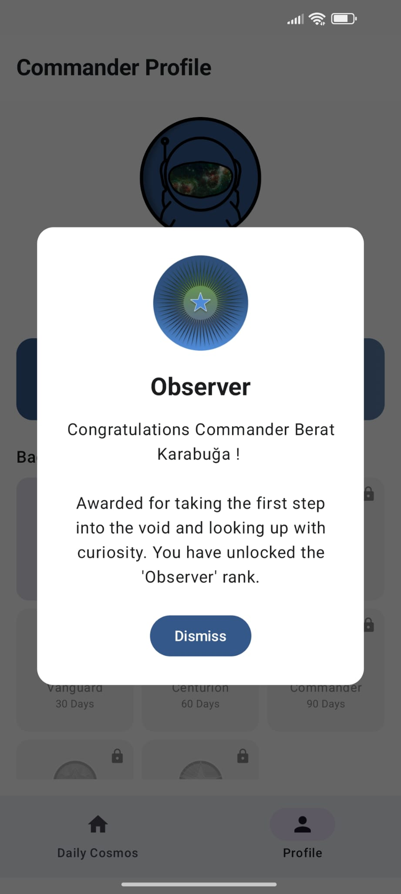 | 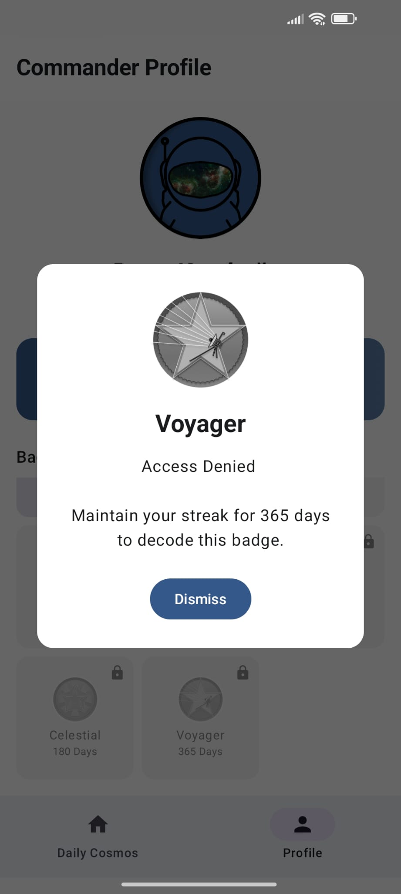 |
| *Deep Space View* | *Stats & Badge Collection* | *New Rank Acquired* | *Locked/Unlocked Info* |

### Dark Theme
| Daily Cosmos (Home) | Commander Profile|
|:---:|:---:|
| 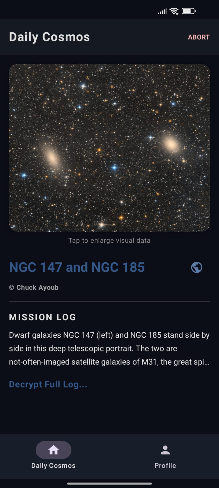 | 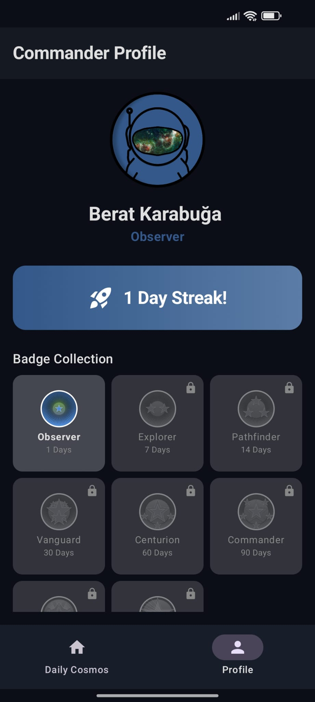 | 
| *Deep Space View* | *Commander Profile* | 
</div>

---

## 🏗 Architecture & Tech Stack

### 🎯 **Architecture Pattern: MVVM + Clean Architecture**

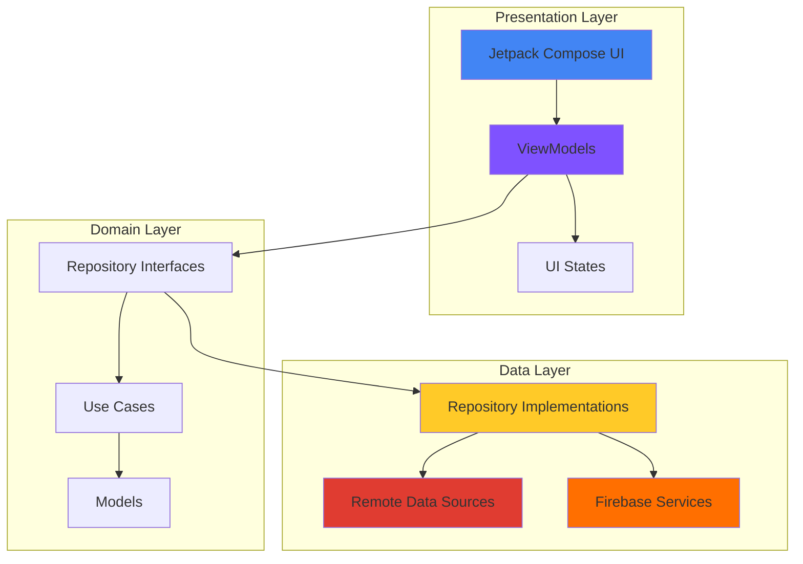

### 🛠️ **Technology Stack**

<table>
<tr>
<th>Category</th>
<th>Technology</th>
<th>Version</th>
<th>Purpose</th>
</tr>
<tr>
<td rowspan="3"><b>🎨 UI</b></td>
<td>Jetpack Compose</td>
<td>1.5.10</td>
<td>Declarative UI framework</td>
</tr>
<tr>
<td>Material Design 3</td>
<td>Latest</td>
<td>Modern design system</td>
</tr>
<tr>
<td>Coil</td>
<td>2.6.0</td>
<td>Async image loading</td>
</tr>
<tr>
<td rowspan="2"><b>🏛️ Architecture</b></td>
<td>MVVM</td>
<td>-</td>
<td>Presentation pattern</td>
</tr>
<tr>
<td>Clean Architecture</td>
<td>-</td>
<td>Layer separation</td>
</tr>
<tr>
<td rowspan="2"><b>💉 DI</b></td>
<td>Hilt</td>
<td>2.50</td>
<td>Dependency injection</td>
</tr>
<tr>
<td>Dagger</td>
<td>2.50</td>
<td>DI framework</td>
</tr>
<tr>
<td rowspan="3"><b>🌐 Network</b></td>
<td>Retrofit</td>
<td>2.9.0</td>
<td>REST client</td>
</tr>
<tr>
<td>OkHttp</td>
<td>4.12.0</td>
<td>HTTP client</td>
</tr>
<tr>
<td>Gson</td>
<td>2.9.0</td>
<td>JSON parsing</td>
</tr>
<tr>
<td rowspan="3"><b>🔥 Backend</b></td>
<td>Firebase Auth</td>
<td>32.7.2</td>
<td>User authentication</td>
</tr>
<tr>
<td>Cloud Firestore</td>
<td>32.7.2</td>
<td>NoSQL database</td>
</tr>
<tr>
<td>Firebase Analytics</td>
<td>32.7.2</td>
<td>Usage tracking</td>
</tr>
<tr>
<td rowspan="2"><b>🧭 Navigation</b></td>
<td>Navigation Compose</td>
<td>2.8.0</td>
<td>Screen navigation</td>
</tr>
<tr>
<td>Kotlin Serialization</td>
<td>1.6.3</td>
<td>Type-safe routing</td>
</tr>
<tr>
<td><b>💾 Storage</b></td>
<td>DataStore</td>
<td>1.0.0</td>
<td>Preferences storage</td>
</tr>
</table>

### 🔄 **Data Flow Architecture**

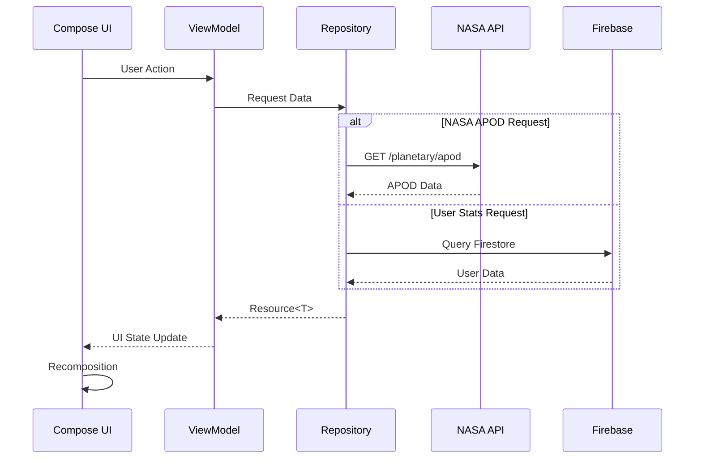

---

## 🚀 Getting Started

### 📋 Prerequisites

Before you begin, ensure you have the following installed:

- ✅ **Android Studio** - Hedgehog (2023.1.1) or newer
- ✅ **JDK** - Version 17 or higher
- ✅ **Android SDK** - Min API 26, Target API 34
- ✅ **Git** - For version control

### 📦 Installation

#### **Step 1: Clone the Repository**

```bash
# HTTPS
git clone https://github.com/berat-karabuga/Stargazer-JetpackCompose-NASA.git

# SSH
git clone git@github.com:berat-karabuga/Stargazer-JetpackCompose-NASA.git

# Navigate to project directory
cd Stargazer-JetpackCompose-NASA
```

#### **Step 2: Set Up Firebase**

1. Go to [Firebase Console](https://console.firebase.google.com/)
2. Create a new project or select existing one
3. Add an Android app with package name: `com.stargazer.stargazer`
4. Download `google-services.json`
5. Place it in the `app/` directory

**Enable Firebase Services:**
```
✅ Authentication → Email/Password
✅ Cloud Firestore → Create database (Start in test mode)
✅ Analytics (Optional)
```

#### **Step 3: Configure NASA API (Optional)**

The project currently includes a **demo/free API key** embedded in the code, so it will work out of the box! 🚀

However, if you want to use your own key to avoid rate limits:
1. Get a free API key from [NASA APIs](https://api.nasa.gov/)
2. Open `app/src/main/java/com/stargazer/stargazer/data/repository/NasaRepositoryImpl.kt`
3. Replace the key string:

```kotlin
val response = api.getAstronomyPictureOfTheDay("YOUR_OWN_API_KEY_HERE")
```

#### **Step 4: Build & Run**

```bash
# Sync Gradle
./gradlew clean build

# Run on emulator or device
./gradlew installDebug
```

**Or use Android Studio:**
1. Open project in Android Studio
2. Wait for Gradle sync
3. Click ▶️ Run button
4. Select device/emulator

---

## 🔧 Configuration

### 🔥 **Firebase Firestore Schema**

```javascript
// Collection: users
users/
  └── {userId}/
       ├── email: String           // User's email address
       ├── username: String        // User's callsign
       ├── streak: Number          // Current login streak
       ├── lastLoginDate: String   // Last login (ISO 8601: "2025-02-13")
       └── maxStreak: Number       // Historical maximum streak
```

**Security Rules Example:**
```javascript
rules_version = '2';
service cloud.firestore {
  match /databases/{database}/documents {
    match /users/{userId} {
      allow read, write: if request.auth != null && request.auth.uid == userId;
    }
  }
}
```

### 🌐 **NASA APOD API Configuration**

**Endpoint:**
```
GET https://api.nasa.gov/planetary/apod
```

**Parameters:**
- `api_key` (required): Your NASA API key
- `date` (optional): YYYY-MM-DD format
- `hd` (optional): Boolean for HD image URL

**Response Sample:**
```json
{
  "date": "2025-02-13",
  "title": "NGC 1365: Majestic Island Universe",
  "explanation": "Barred spiral galaxy NGC 1365...",
  "url": "https://apod.nasa.gov/apod/image/2502/NGC1365.jpg",
  "hdurl": "https://apod.nasa.gov/apod/image/2502/NGC1365_HD.jpg",
  "media_type": "image",
  "copyright": "John Doe Observatory"
}
```

---

## 📊 Project Structure

```
com.stargazer.stargazer/
│
├── 📱 presentation/                    # UI Layer
│   ├── 🔐 auth/
│   │   ├── AuthViewModel.kt          # Authentication state management
│   │   ├── LoginScreen.kt            # Login UI
│   │   └── SignUpScreen.kt           # Registration UI
│   │
│   ├── 🏠 home/
│   │   ├── HomeViewModel.kt          # APOD data management
│   │   └── HomeScreen.kt             # Main feed UI
│   │
│   ├── 👤 profile/
│   │   ├── ProfileViewModel.kt       # User stats management
│   │   └── ProfileScreen.kt          # Profile UI with badges
│   │
│   ├── 💫 splash/
│   │   └── SplashScreen.kt           # Animated splash screen
│   │
│   └── StargazerRoot.kt              # Navigation host
│
├── 🏛️ domain/                          # Business Logic Layer
│   └── repository/
│       ├── AuthRepository.kt         # Auth contract
│       └── NasaRepository.kt         # NASA API contract
│
├── 💾 data/                            # Data Layer
│   ├── model/
│   │   ├── ApodModel.kt             # NASA APOD model
│   │   └── UserStats.kt             # User statistics model
│   │
│   ├── remote/
│   │   └── NasaApi.kt               # Retrofit interface
│   │
│   └── repository/
│       ├── AuthRepositoryImpl.kt    # Auth implementation
│       └── NasaRepositoryImpl.kt    # NASA implementation
│
├── 💉 di/                              # Dependency Injection
│   └── AppModule.kt                  # Hilt module
│
├── 🎨 ui.theme/                        # Design System
│   ├── Color.kt                      # Color palette
│   ├── Theme.kt                      # Material theme
│   └── Type.kt                       # Typography
│
└── 🛠️ util/                            # Utilities
    ├── Resource.kt                   # Network state wrapper
    └── Screen.kt                     # Navigation routes
```

---

## 🏆 Achievement System

### 🎖️ **Military-Inspired Rank Progression**

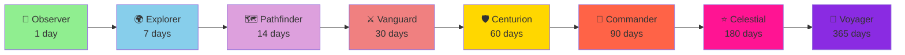

### 📜 **Complete Badge Breakdown**

| Rank | Icon | Days | Title | Description | Unlock Message |
|------|------|------|-------|-------------|----------------|
| 1 | 🔭 | 1 | **Observer** | Entry-level astronomer | "For taking the first step into the void and looking up with curiosity" |
| 2 | 🌍 | 7 | **Explorer** | Week-long commitment | "A week of relentless curiosity and stability" |
| 3 | 🗺️ | 14 | **Pathfinder** | Two-week veteran | "The determination to discover new paths in the cosmos" |
| 4 | ⚔️ | 30 | **Vanguard** | Monthly achiever | "A month of unwavering discipline and pioneering spirit" |
| 5 | 🛡️ | 60 | **Centurion** | Two-month dedication | "Two months of experience and loyalty to the space corps" |
| 6 | 👑 | 90 | **Commander** | Seasonal master | "Leadership and wisdom demonstrated over a full season" |
| 7 | ⭐ | 180 | **Celestial** | Half-year legend | "A legendary half-year journey and celestial knowledge" |
| 8 | 🚀 | 365 | **Voyager** | Annual elite | "Mastering the infinity journey over a complete solar cycle" |

### ⚙️ **Streak Calculation Logic**

```kotlin
fun updateStreak(lastLogin: String, currentDate: String): Int {
    val yesterday = currentDate.minusDays(1)
    
    return when (lastLogin) {
        currentDate -> currentStreak        // Same day → No change
        yesterday   -> currentStreak + 1    // Yesterday → Increment
        else        -> 1                    // Older → Reset
    }
}
```

**Visual Flow:**
```
User Opens App
      ↓
Check Last Login Date
      ↓
      ├─→ Today? → Keep Streak
      ├─→ Yesterday? → +1 Streak
      └─→ Older? → Reset to 1
      ↓
Update Firestore
      ↓
Show Streak Animation
```

---

## 🔌 API Integration

### 🌐 **NASA APOD API**

**Implementation in Retrofit:**

```kotlin
interface NasaApi {
    @GET("planetary/apod")
    suspend fun getAstronomyPictureOfTheDay(
        @Query("api_key") apiKey: String
    ): Response<ApodModel>
}
```

**Repository Pattern:**

```kotlin
override suspend fun getDailyPhoto(): Resource<ApodModel> {
    return try {
        val response = api.getAstronomyPictureOfTheDay(NASA_API_KEY)
        if (response.isSuccessful && response.body() != null) {
            Resource.Success(response.body()!!)
        } else {
            Resource.Error(response.message())
        }
    } catch (e: Exception) {
        Resource.Error("Network error: ${e.localizedMessage}")
    }
}
```

### 🔥 **Firebase Integration**

**Authentication:**
```kotlin
suspend fun login(email: String, password: String): Resource<FirebaseUser> {
    return try {
        val result = firebaseAuth
            .signInWithEmailAndPassword(email, password)
            .await()
        Resource.Success(result.user!!)
    } catch (e: Exception) {
        Resource.Error(e.localizedMessage ?: "Login failed")
    }
}
```

**Firestore Operations:**
```kotlin
suspend fun updateUserStreak(uid: String): Resource<UserStats> {
    val docRef = firestore.collection("users").document(uid)
    val snapshot = docRef.get().await()
    
    // Streak calculation logic
    val updatedStats = calculateNewStreak(snapshot)
    
    docRef.set(updatedStats, SetOptions.merge()).await()
    return Resource.Success(updatedStats)
}
```

---

## 🤝 Contributing

We welcome contributions! Here's how you can help:

### 🐛 **Report Bugs**

Found a bug? [Open an issue](https://github.com/berat-karabuga/Stargazer-JetpackCompose-NASA/issues) with:
- Clear description
- Steps to reproduce
- Expected vs actual behavior
- Screenshots/logs

### ✨ **Suggest Features**

Have an idea? [Start a discussion](https://github.com/berat-karabuga/Stargazer-JetpackCompose-NASA/discussions) with:
- Feature description
- Use case
- Mockups (if applicable)

### 🔀 **Submit Pull Requests**

1. Fork the repository
2. Create your feature branch:
   ```bash
   git checkout -b feature/AmazingFeature
   ```
3. Commit your changes:
   ```bash
   git commit -m 'Add some AmazingFeature'
   ```
4. Push to the branch:
   ```bash
   git push origin feature/AmazingFeature
   ```
5. Open a Pull Request
---

## 📄 License

```
MIT License

Copyright (c) 2026 Berat Karabuga

Permission is hereby granted, free of charge, to any person obtaining a copy
of this software and associated documentation files (the "Software"), to deal
in the Software without restriction, including without limitation the rights
to use, copy, modify, merge, publish, distribute, sublicense, and/or sell
copies of the Software, and to permit persons to whom the Software is
furnished to do so, subject to the following conditions:

The above copyright notice and this permission notice shall be included in all
copies or substantial portions of the Software.

THE SOFTWARE IS PROVIDED "AS IS", WITHOUT WARRANTY OF ANY KIND, EXPRESS OR
IMPLIED, INCLUDING BUT NOT LIMITED TO THE WARRANTIES OF MERCHANTABILITY,
FITNESS FOR A PARTICULAR PURPOSE AND NONINFRINGEMENT. IN NO EVENT SHALL THE
AUTHORS OR COPYRIGHT HOLDERS BE LIABLE FOR ANY CLAIM, DAMAGES OR OTHER
LIABILITY, WHETHER IN AN ACTION OF CONTRACT, TORT OR OTHERWISE, ARISING FROM,
OUT OF OR IN CONNECTION WITH THE SOFTWARE OR THE USE OR OTHER DEALINGS IN THE
SOFTWARE.
```

---

## 👨‍💻 Developer

<div align="center">

### Berat Karabuga

[](https://github.com/berat-karabuga)
[](https://linkedin.com/in/berat-karabuga)
[](mailto:your.email@example.com)

**"Turning cosmic data into daily inspiration"**

</div>

---

## 🙏 Acknowledgments

Special thanks to:

- 🚀 **NASA** - For providing the incredible APOD API
- 🔥 **Google Firebase** - For authentication and database infrastructure
- 🎨 **Material Design Team** - For the beautiful design system
- 💚 **Android Dev Community** - For continuous support and inspiration
- ⭐ **Contributors** - Everyone who helped improve Stargazer

---

<div align="center">

### 💫 If you found this project helpful, please consider giving it a ⭐!

</div>
